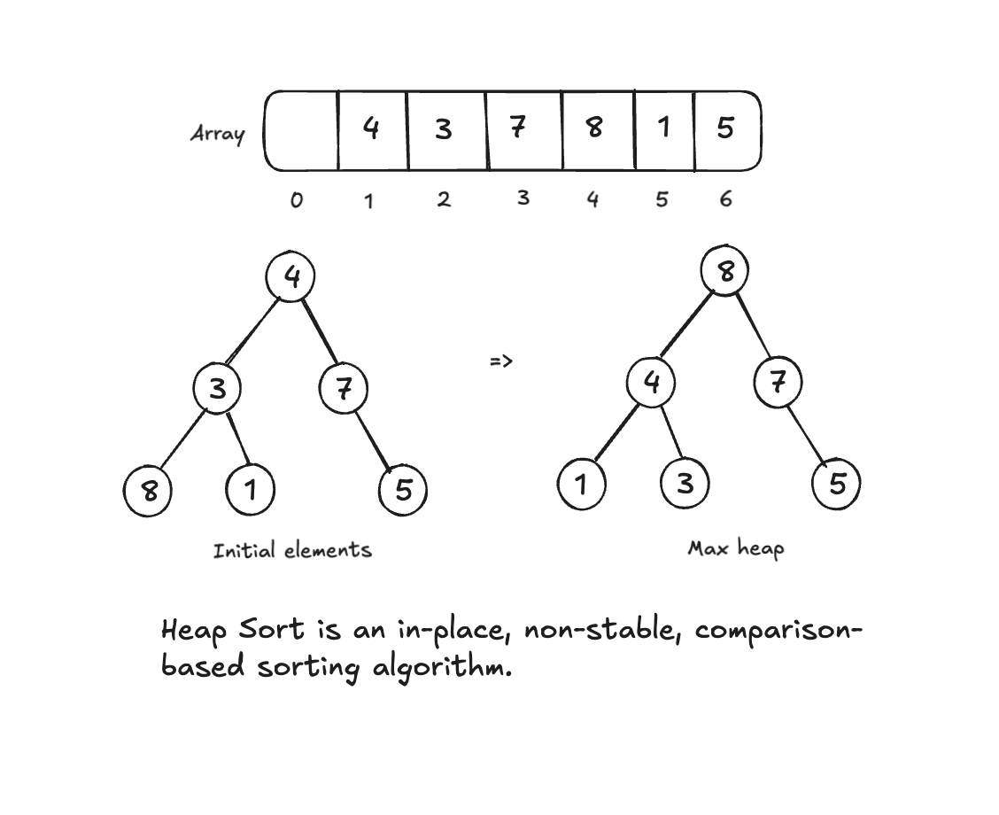

# Heap Sort Challenges



## Table of Contents

1. [Beginner: Implement Basic Heap Sort](#1-beginner-implement-basic-heap-sort)
2. [Intermediate: Sort in Descending Order](#2-intermediate-sort-in-descending-order)
3. [Intermediate: Visualize Heap Construction](#3-intermediate-visualize-heap-construction)
4. [Advanced: Handle Arrays with Duplicate Elements](#4-advanced-handle-arrays-with-duplicate-elements)
5. [Advanced: Sort an Array of Objects](#5-advanced-sort-an-array-of-objects)
6. [Expert: Count Comparisons and Swaps](#6-expert-count-comparisons-and-swaps)
7. [Expert: Optimize for Memory Usage](#7-expert-optimize-for-memory-usage)

---

### **1. Beginner: Implement Basic Heap Sort**

**Description:**  
Write a function to implement the basic Heap Sort algorithm to sort an array of integers in ascending order.

**Input Example:**  
`[8, 3, 7, 6, 2]`

**Output Example:**  
`[2, 3, 6, 7, 8]`

**Hints:**

- First, build a Max-Heap from the array.
- Repeatedly extract the largest element (root) and rebuild the heap for the remaining elements.

**Difficulty:** Beginner

---

### **2. Intermediate: Sort in Descending Order**

**Description:**  
Modify the Heap Sort algorithm to sort an array in descending order using a Min-Heap instead of a Max-Heap.

**Input Example:**  
`[8, 3, 7, 6, 2]`

**Output Example:**  
`[8, 7, 6, 3, 2]`

**Hints:**

- Change the heap property to a Min-Heap during construction.
- Ensure you still swap the root with the last element during extraction.

**Difficulty:** Intermediate

---

### **3. Intermediate: Visualize Heap Construction**

**Description:**  
Create a function that visualizes the construction of a Max-Heap from an unsorted array by showing the state of the array after each step.

**Input Example:**  
`[8, 3, 7, 6, 2]`

**Output Example:**

```
Step 1: [8, 3, 7, 6, 2] (initial)
Step 2: [8, 6, 7, 3, 2] (after heapify at index 1)
Step 3: [8, 6, 7, 3, 2] (after heapify at index 0)
Final Max-Heap: [8, 6, 7, 3, 2]
```

**Hints:**

- Use a helper function for `heapify`.
- Log the array after every modification.

**Difficulty:** Intermediate

---

### **4. Advanced: Handle Arrays with Duplicate Elements**

**Description:**  
Modify the Heap Sort algorithm to handle arrays with duplicate elements efficiently.

**Input Example:**  
`[8, 3, 7, 3, 2, 3]`

**Output Example:**  
`[2, 3, 3, 3, 7, 8]`

**Hints:**

- Ensure duplicates are placed correctly in the final sorted array without impacting performance.

**Difficulty:** Advanced

---

### **5. Advanced: Sort an Array of Objects**

**Description:**  
Write a function to sort an array of objects using Heap Sort based on a specified property, such as `age` or `name`.

**Input Example:**

```javascript
[
  { name: "Alice", age: 25 },
  { name: "Bob", age: 20 },
  { name: "Charlie", age: 23 },
];
```

**Output Example:**  
Sorted by `age`:

```javascript
[
  { name: "Bob", age: 20 },
  { name: "Charlie", age: 23 },
  { name: "Alice", age: 25 },
];
```

**Hints:**

- Use a comparison function to handle sorting based on a property.
- Ensure the heap property is updated to consider the chosen property.

**Difficulty:** Advanced

---

### **6. Expert: Count Comparisons and Swaps**

**Description:**  
Modify the Heap Sort algorithm to count the total number of comparisons and swaps made during the sorting process.

**Input Example:**  
`[8, 3, 7, 6, 2]`

**Output Example:**  
Sorted Array: `[2, 3, 6, 7, 8]`  
Number of Comparisons: `12`  
Number of Swaps: `8`

**Hints:**

- Use counters to track comparisons during `heapify`.
- Count swaps when rearranging elements.

**Difficulty:** Expert

---

### **7. Expert: Optimize for Memory Usage**

**Description:**  
Analyze and optimize the Heap Sort algorithm to minimize memory usage while sorting extremely large arrays.

**Challenge:**  
Ensure your algorithm remains efficient even for arrays too large to fit entirely in memory.

**Hints:**

- Process the array in chunks if necessary.
- Avoid unnecessary temporary data structures.

**Difficulty:** Expert

---

## How to Use This Guide

1. Start with the beginner challenge to understand the basics of Heap Sort.
2. Progress through intermediate challenges to explore variations and visualization techniques.
3. Tackle advanced and expert challenges to implement custom versions and optimize for performance and memory.
