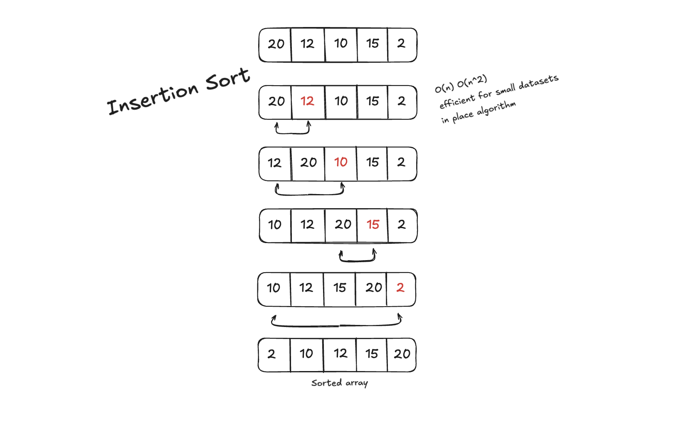

# Insertion Sort Challenges



## Table of Contents

1. [Beginner: Implement Basic Insertion Sort](#1-beginner-implement-basic-insertion-sort)
2. [Intermediate: Sort in Descending Order](#2-intermediate-sort-in-descending-order)
3. [Intermediate: Count the Number of Shifts](#3-intermediate-count-the-number-of-shifts)
4. [Advanced: Binary Insertion Sort](#4-advanced-binary-insertion-sort)
5. [Advanced: Handle Duplicate Elements](#5-advanced-handle-duplicate-elements)
6. [Expert: Sort an Array of Objects](#6-expert-sort-an-array-of-objects)
7. [Expert: Visualize Sorting Steps](#7-expert-visualize-sorting-steps)

---

### **1. Beginner: Implement Basic Insertion Sort**

**Description:**  
Write a function to implement the basic Insertion Sort algorithm to sort an array of integers in ascending order.

**Input Example:**  
`[8, 3, 7, 6, 2]`

**Output Example:**  
`[2, 3, 6, 7, 8]`

**Hints:**

- Iterate through the array, treating the first element as sorted.
- For each element, find the correct position in the sorted portion and insert it.

**Difficulty:** Beginner

---

### **2. Intermediate: Sort in Descending Order**

**Description:**  
Modify the Insertion Sort algorithm to sort an array in descending order.

**Input Example:**  
`[8, 3, 7, 6, 2]`

**Output Example:**  
`[8, 7, 6, 3, 2]`

**Hints:**

- Change the comparison in the insertion step to reverse the sorting order.

**Difficulty:** Intermediate

---

### **3. Intermediate: Count the Number of Shifts**

**Description:**  
Modify the Insertion Sort algorithm to count the total number of shifts (or moves) made during the sorting process. A "shift" occurs when an element is moved to the right to make space for the current element.

**Input Example:**  
`[8, 3, 7, 6, 2]`

**Output Example:**  
Sorted Array: `[2, 3, 6, 7, 8]`  
Number of Shifts: `7`

**Challenge:**  
Keep track of the number of shifts without disrupting the sorting logic.

**Difficulty:** Intermediate

---

### **4. Advanced: Binary Insertion Sort**

**Description:**  
Instead of linearly searching for the correct position in the sorted portion, use **binary search** to find the position. Implement a version of Insertion Sort that reduces comparisons by using binary search.

**Input Example:**  
`[8, 3, 7, 6, 2]`

**Output Example:**  
`[2, 3, 6, 7, 8]`

**Hints:**

- Use binary search to determine the correct index for each element.
- Shift elements as needed to insert the current element in the correct position.

**Difficulty:** Advanced

---

### **5. Advanced: Handle Duplicate Elements**

**Description:**  
Modify the Insertion Sort algorithm to handle arrays with duplicate elements efficiently, ensuring they remain stable (i.e., their relative order is preserved).

**Input Example:**  
`[8, 3, 7, 3, 2, 3]`

**Output Example:**  
`[2, 3, 3, 3, 7, 8]`

**Hints:**

- Ensure that equal elements retain their original order in the sorted array.

**Difficulty:** Advanced

---

### **6. Expert: Sort an Array of Objects**

**Description:**  
Write a function to sort an array of objects using Insertion Sort based on a specified property, such as `age` or `name`.

**Input Example:**

```javascript
[
  { name: "Alice", age: 25 },
  { name: "Bob", age: 20 },
  { name: "Charlie", age: 23 },
];
```

**Output Example:**  
Sorted by `age`:

```javascript
[
  { name: "Bob", age: 20 },
  { name: "Charlie", age: 23 },
  { name: "Alice", age: 25 },
];
```

**Hints:**

- Allow the property to sort by (e.g., `age`, `name`) to be passed as a parameter.

**Difficulty:** Expert

---

### **7. Expert: Visualize Sorting Steps**

**Description:**  
Create a function that not only sorts the array using Insertion Sort but also logs each step of the sorting process, showing the array at every stage.

**Input Example:**  
`[8, 3, 7, 6, 2]`

**Output Example:**

```
Step 1: [8, 3, 7, 6, 2]
Step 2: [3, 8, 7, 6, 2]
Step 3: [3, 7, 8, 6, 2]
Step 4: [3, 6, 7, 8, 2]
Step 5: [2, 3, 6, 7, 8]
Final Sorted Array: [2, 3, 6, 7, 8]
```

**Hints:**

- Use console logging to show the array after every insertion step.

**Difficulty:** Expert

---

## How to Use This Guide

1. Start with the beginner challenges to understand the basics of Insertion Sort.
2. Move to intermediate challenges to explore variations and count operations.
3. Progress to advanced and expert challenges to implement efficient and custom versions of the algorithm.
