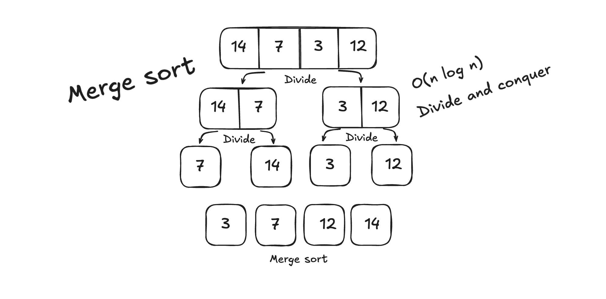

# Merge Sort Challenges



## Table of Contents

1. [Beginner: Implement Basic Merge Sort](#1-beginner-implement-basic-merge-sort)
2. [Intermediate: Sort in Descending Order](#2-intermediate-sort-in-descending-order)
3. [Intermediate: Count the Number of Comparisons](#3-intermediate-count-the-number-of-comparisons)
4. [Advanced: Merge Two Sorted Arrays](#4-advanced-merge-two-sorted-arrays)
5. [Advanced: Handle Edge Cases](#5-advanced-handle-edge-cases)
6. [Expert: Parallel Merge Sort](#6-expert-parallel-merge-sort)
7. [Expert: Sort an Array of Objects](#7-expert-sort-an-array-of-objects)

---

### **1. Beginner: Implement Basic Merge Sort**

**Description:**  
Write a function to implement the basic Merge Sort algorithm that sorts an array of integers in ascending order.

**Input Example:**  
`[38, 27, 43, 3, 9, 82, 10]`

**Output Example:**  
`[3, 9, 10, 27, 38, 43, 82]`

**Hints:**

- Divide the array into halves recursively.
- Merge the sorted halves into a single sorted array.

**Difficulty:** Beginner

---

### **2. Intermediate: Sort in Descending Order**

**Description:**  
Modify the Merge Sort algorithm to sort the array in descending order instead of ascending order.

**Input Example:**  
`[38, 27, 43, 3, 9, 82, 10]`

**Output Example:**  
`[82, 43, 38, 27, 10, 9, 3]`

**Hints:**

- Change the comparison in the merge step to reverse the order.

**Difficulty:** Intermediate

---

### **3. Intermediate: Count the Number of Comparisons**

**Description:**  
Modify the Merge Sort algorithm to count the total number of element comparisons made during the sorting process.

**Input Example:**  
`[5, 3, 8, 6, 2]`

**Output Example:**  
Sorted Array: `[2, 3, 5, 6, 8]`  
Number of Comparisons: `7`

**Challenge:**  
Keep track of comparisons efficiently without altering the core logic too much.

**Difficulty:** Intermediate

---

### **4. Advanced: Merge Two Sorted Arrays**

**Description:**  
Write a function to merge two already sorted arrays into a single sorted array without using the full Merge Sort algorithm.

**Input Example:**  
Array 1: `[1, 3, 5]`  
Array 2: `[2, 4, 6]`

**Output Example:**  
`[1, 2, 3, 4, 5, 6]`

**Hints:**

- Use two pointers to compare elements from both arrays.

**Difficulty:** Advanced

---

### **5. Advanced: Handle Edge Cases**

**Description:**  
Implement a robust version of Merge Sort that handles the following edge cases:

1. Empty array (`[]`)
2. Array with one element (`[42]`)
3. Array with duplicate elements (`[5, 3, 5, 3]`)
4. Array with negative numbers (`[-1, -5, 3, 0]`)

**Input Example:**  
`[]`, `[42]`, `[5, 3, 5, 3]`, `[-1, -5, 3, 0]`

**Output Example:**

- `[]` → `[]`
- `[42]` → `[42]`
- `[5, 3, 5, 3]` → `[3, 3, 5, 5]`
- `[-1, -5, 3, 0]` → `[-5, -1, 0, 3]`

**Challenge:**  
Your implementation should handle these scenarios without breaking.

**Difficulty:** Advanced

---

### **6. Expert: Parallel Merge Sort**

**Description:**  
Modify Merge Sort to take advantage of multi-threading or parallel processing to sort very large arrays efficiently.

**Input Example:**  
A random array with 1 million elements.

**Output Example:**  
The array sorted in ascending order.

**Challenge:**

- Use Node.js worker threads or an external library for parallel processing.
- Measure the performance improvement over standard Merge Sort.

**Difficulty:** Expert

---

### **7. Expert: Sort an Array of Objects**

**Description:**  
Sort an array of objects using Merge Sort based on a specified property, such as `age` or `name`.

**Input Example:**

```javascript
[
  { name: "Alice", age: 25 },
  { name: "Bob", age: 20 },
  { name: "Charlie", age: 23 },
];
```

**Output Example:**  
Sorted by age:

```javascript
[
  { name: "Bob", age: 20 },
  { name: "Charlie", age: 23 },
  { name: "Alice", age: 25 },
];
```

**Challenge:**  
Allow dynamic sorting based on any property (e.g., `age`, `name`).

**Difficulty:** Expert

---

## How to Use This Guide

1. Start with the beginner challenges to understand the basics of Merge Sort.
2. Progress through intermediate and advanced challenges to explore practical applications and variations.
3. Tackle expert-level challenges to test your knowledge and skills with complex scenarios.
