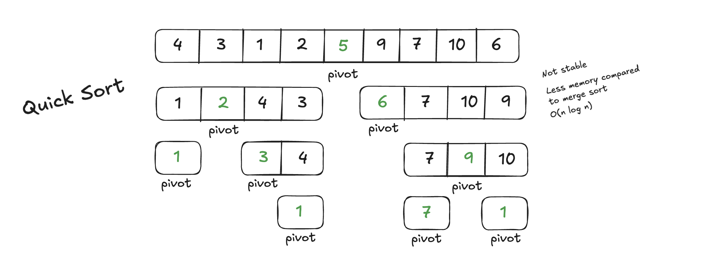

# Quick Sort Challenges



## Table of Contents

1. [Beginner: Implement Basic Quick Sort](#1-beginner-implement-basic-quick-sort)
2. [Intermediate: Implement In-Place Quick Sort](#2-intermediate-implement-in-place-quick-sort)
3. [Intermediate: Sort in Descending Order](#3-intermediate-sort-in-descending-order)
4. [Advanced: Track Number of Comparisons and Swaps](#4-advanced-track-number-of-comparisons-and-swaps)
5. [Advanced: Handle Duplicate Elements Efficiently](#5-advanced-handle-duplicate-elements-efficiently)
6. [Expert: Sort an Array of Objects](#6-expert-sort-an-array-of-objects)
7. [Expert: Optimize Pivot Selection](#7-expert-optimize-pivot-selection)

---

### **1. Beginner: Implement Basic Quick Sort**

**Description:**  
Write a function to implement the basic Quick Sort algorithm that sorts an array of integers in ascending order. Use a new array for partitioning.

**Input Example:**  
`[8, 3, 7, 6, 1, 5]`

**Output Example:**  
`[1, 3, 5, 6, 7, 8]`

**Hints:**

- Choose the pivot as the last element of the array.
- Partition the array into two subarrays: one with elements smaller than the pivot and one with elements larger.

**Difficulty:** Beginner

---

### **2. Intermediate: Implement In-Place Quick Sort**

**Description:**  
Modify the Quick Sort algorithm to sort the array in place, without using extra space for partitioning.

**Input Example:**  
`[8, 3, 7, 6, 1, 5]`

**Output Example:**  
`[1, 3, 5, 6, 7, 8]`

**Hints:**

- Use two pointers to partition the array.
- Swap elements in place instead of creating new arrays.

**Difficulty:** Intermediate

---

### **3. Intermediate: Sort in Descending Order**

**Description:**  
Modify the Quick Sort algorithm to sort the array in descending order instead of ascending order.

**Input Example:**  
`[8, 3, 7, 6, 1, 5]`

**Output Example:**  
`[8, 7, 6, 5, 3, 1]`

**Hints:**

- Change the comparison in the partitioning step to reverse the order.

**Difficulty:** Intermediate

---

### **4. Advanced: Track Number of Comparisons and Swaps**

**Description:**  
Write a function to sort an array using Quick Sort, but also keep track of the total number of comparisons and swaps made during the process.

**Input Example:**  
`[8, 3, 7, 6, 1, 5]`

**Output Example:**  
Sorted Array: `[1, 3, 5, 6, 7, 8]`  
Number of Comparisons: `11`  
Number of Swaps: `7`

**Challenge:**  
Efficiently count comparisons and swaps without significantly altering the core logic.

**Difficulty:** Advanced

---

### **5. Advanced: Handle Duplicate Elements Efficiently**

**Description:**  
Modify Quick Sort to handle arrays with duplicate elements efficiently, ensuring no unnecessary swaps or partitioning issues.

**Input Example:**  
`[4, 2, 4, 8, 4, 3]`

**Output Example:**  
`[2, 3, 4, 4, 4, 8]`

**Hints:**

- Use the **three-way partitioning** technique:
  - Subarray for elements less than the pivot.
  - Subarray for elements equal to the pivot.
  - Subarray for elements greater than the pivot.

**Difficulty:** Advanced

---

### **6. Expert: Sort an Array of Objects**

**Description:**  
Write a function to sort an array of objects using Quick Sort based on a specific property, such as `age` or `name`.

**Input Example:**

```javascript
[
  { name: "Alice", age: 25 },
  { name: "Bob", age: 20 },
  { name: "Charlie", age: 23 },
];
```

**Output Example:**  
Sorted by `age`:

```javascript
[
  { name: "Bob", age: 20 },
  { name: "Charlie", age: 23 },
  { name: "Alice", age: 25 },
];
```

**Challenge:**  
Allow dynamic sorting based on a property passed as a parameter (e.g., `age`, `name`).

**Difficulty:** Expert

---

### **7. Expert: Optimize Pivot Selection**

**Description:**  
Optimize the pivot selection process in Quick Sort to avoid the worst-case performance (\(O(n^2)\)). Implement a **median-of-three** strategy:

1. Select the first, middle, and last elements of the array.
2. Choose the median of these three as the pivot.

**Input Example:**  
`[8, 3, 7, 6, 1, 5]`

**Output Example:**  
`[1, 3, 5, 6, 7, 8]`

**Hints:**

- Implement the median-of-three pivot selection as part of the partitioning logic.
- Compare the results with the standard Quick Sort implementation.

**Difficulty:** Expert

---

## How to Use This Guide

1. Start with the beginner challenges to understand the basics of Quick Sort.
2. Progress to intermediate and advanced challenges to deepen your understanding.
3. Tackle expert-level challenges to optimize and customize Quick Sort for real-world scenarios.
